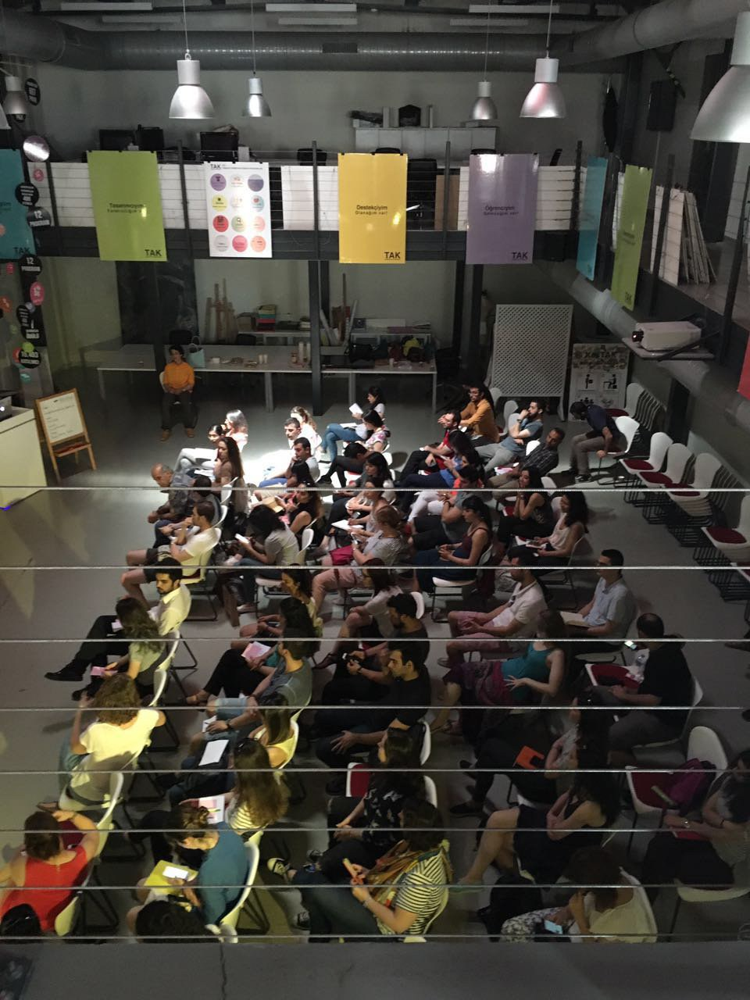
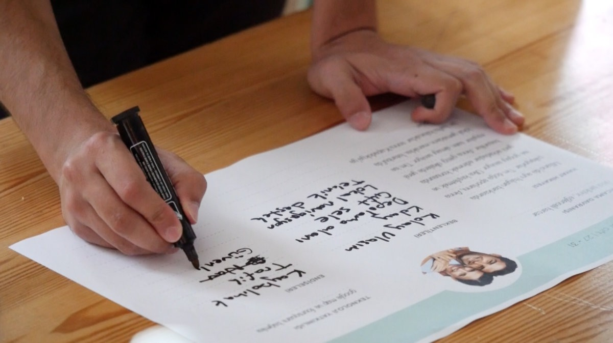
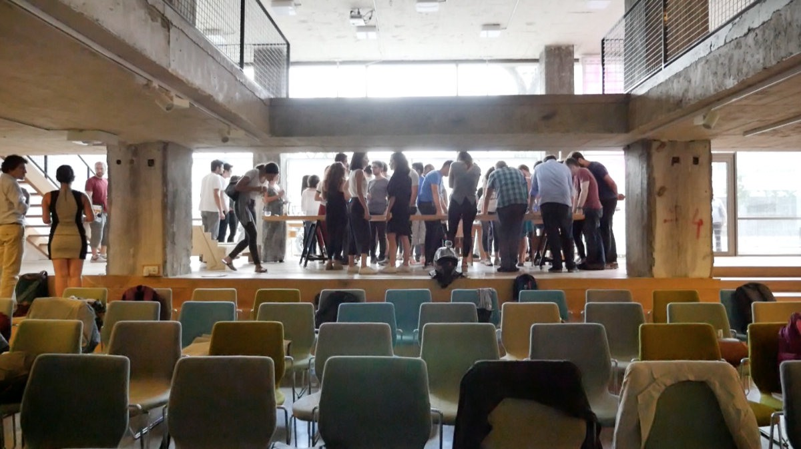
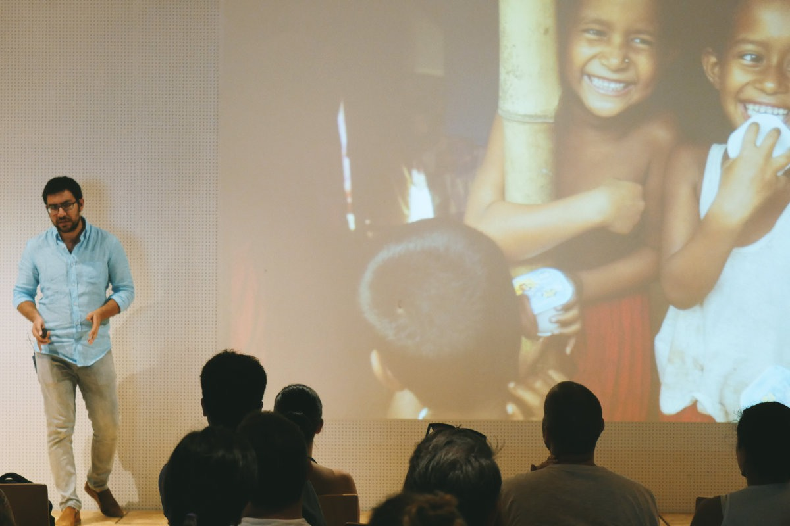
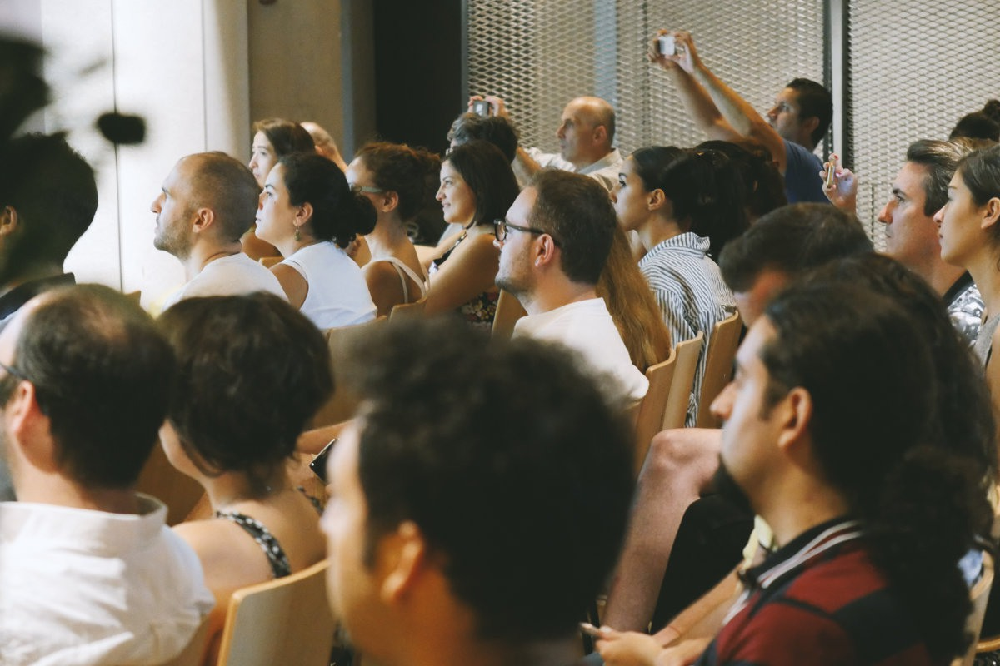
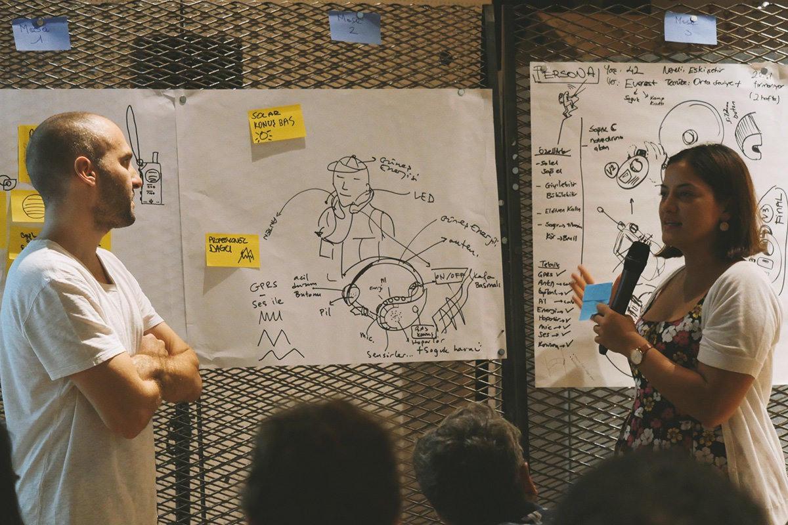
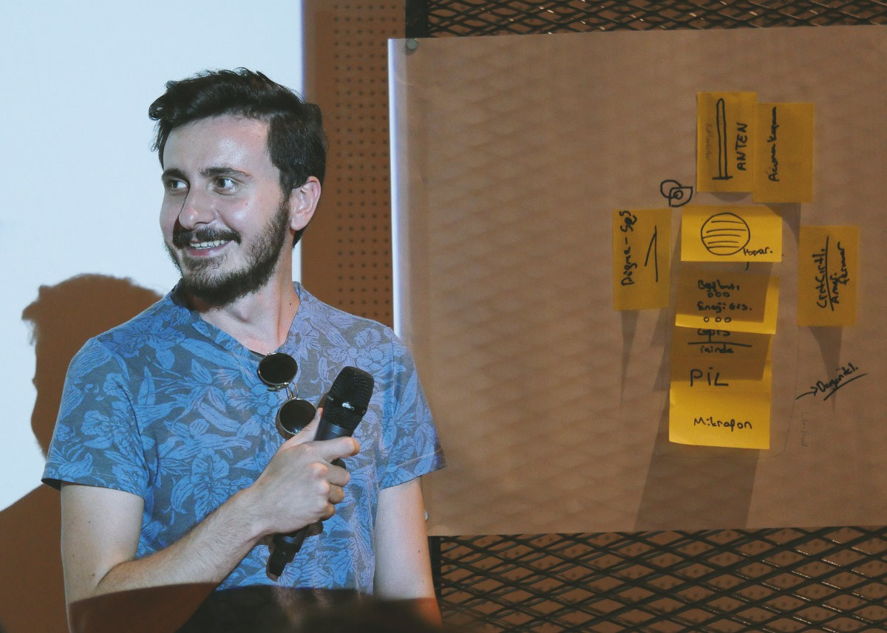
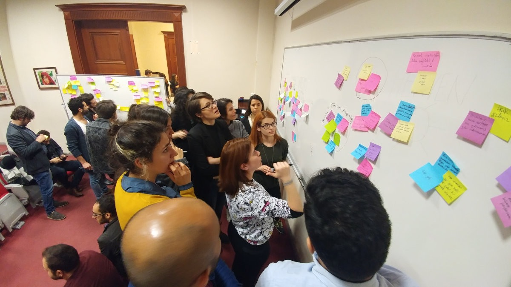
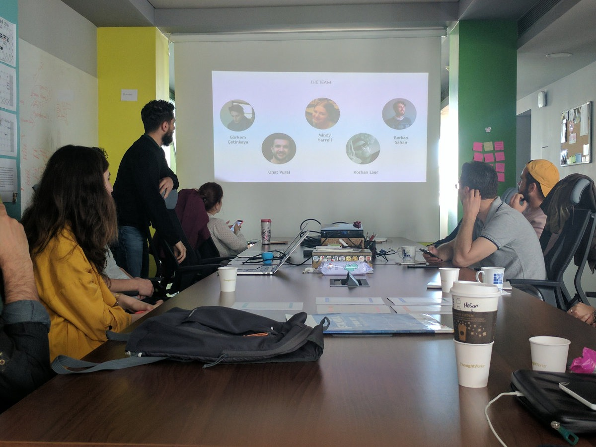
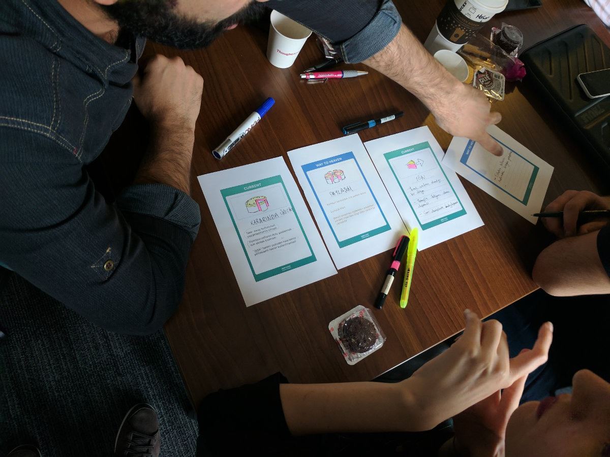

#  Humble Start

DTT is a meetup series where we brought startups, professionals and students together and share their failures/successes with each other. The first meetup was just for fun and beers but received very positive feedback. Nearly all the attendees asked to make another one. We immediately sat down and planned the next meetup as a series. 

Noticing such need (and having so many people together who are interested in design thinking methodologies, we decided to include a few mockup workshop ideas where people can exercise solving the mock problems. Of course, it wasn't like a contest or anything. We were just enabling a platform where people can exercise with other minds.

After a few more meets, we got in touch with openIDEO and told us that we can transform all of this interest into a meaningful and beneficial output for everyone. Following that we've successfully formed the openIDEO's Istanbul chapter. During 2018 I had to depart away from DTT and it's a community to relocate to London. Now it's lead by volunteering and it's still functioning today and has been working with the Istanbul municipality together.

