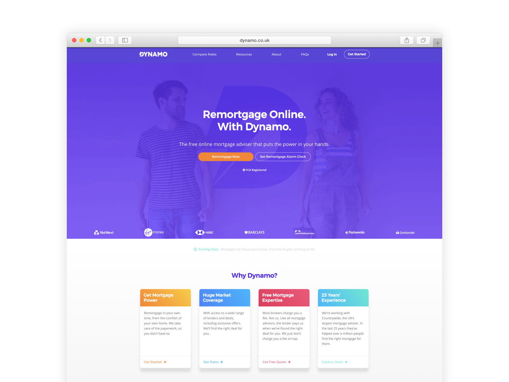
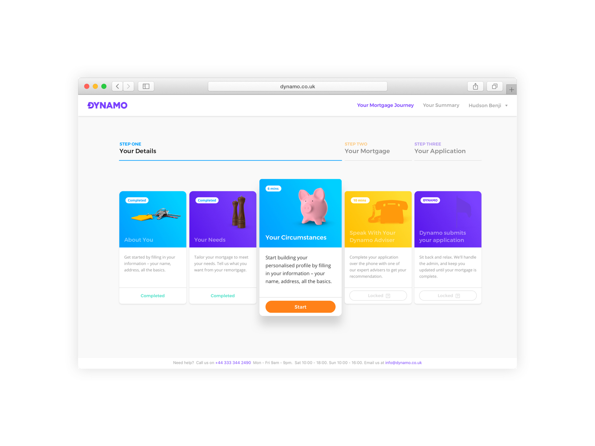
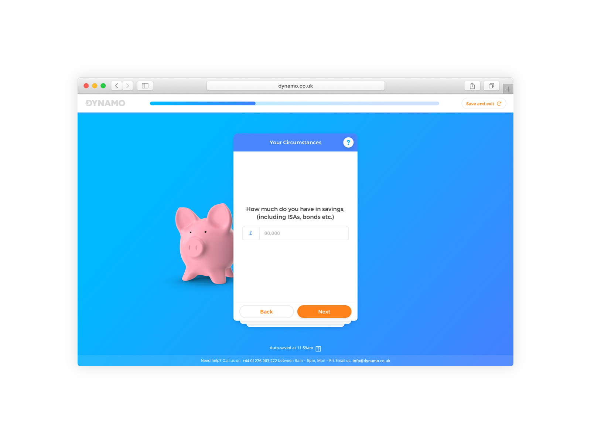
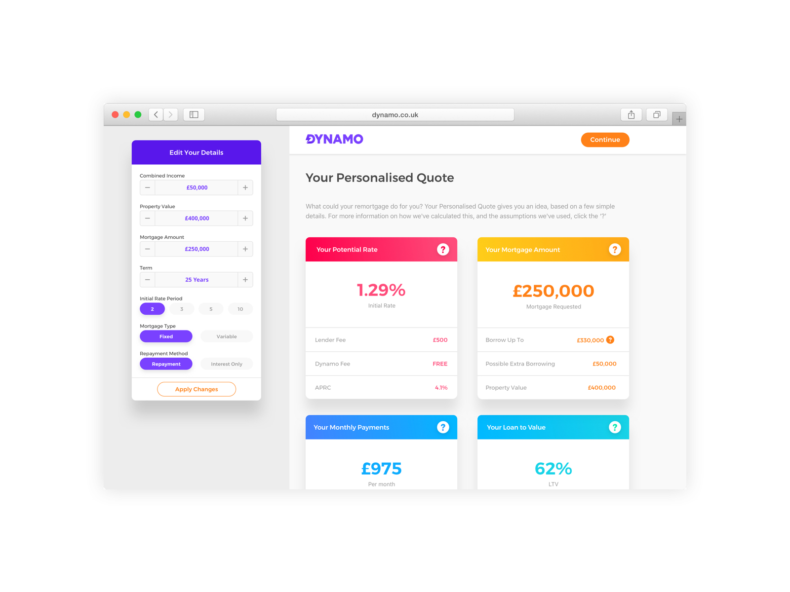
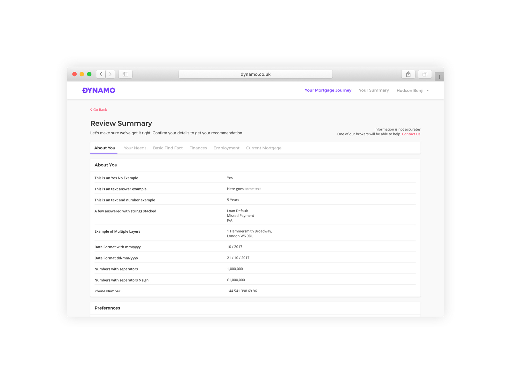
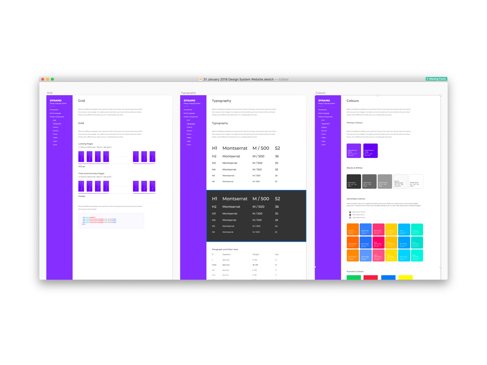

# Mortgages are 😞

It's not a secret that mortgages are boring. Especially when it's about "RE" mortgaging - a process where you renew your mortgage package for a better deal. Dynamo is here to make the whole process easy and enable users to apply in a pace that they'd like to -which is usually had to be done in one go. 

# User Inputs

When I got onboarded on to the project, the product needed to be released within a month. There was a heavy need for design solutions and user research (with a minimal budget). My first instinct onboarded on the project, I've immediately started doing interviews with my friends, people around me and the office about their mortgage experiences during my spare time. This grew into a habit during the projects as there weren't any 'spare' time slot could be assigned to do such task.

# Guerrilla Interviews

Through the interviews/dialogues (rarely rants), there was one major output. It was obvious that 'remortgaging' was a hassle for people and no one liked it. We start to develop new ideas to reshape such disliked process. The branding was playing a great factor in this process. Intentionally it was created jolly and lovable.

# Making it fun

But the content wasn't fun. The major issue was the nature of remortgaging process. It's heavily relied on collecting as much as personal data as it could be. It was either done in one session -mostly a whole day- or done in several small sessions distributed over a month. We could basically generate a data form collecting this information and directly serve to the mortgage brokers. 

# A fresh take for surveying

No matter what type of innovation we could think of, the questionnaire was unavoidable. That's why we turned it into a playful and fun 'card play' themed form where users could save their progression and leave at any point. 

