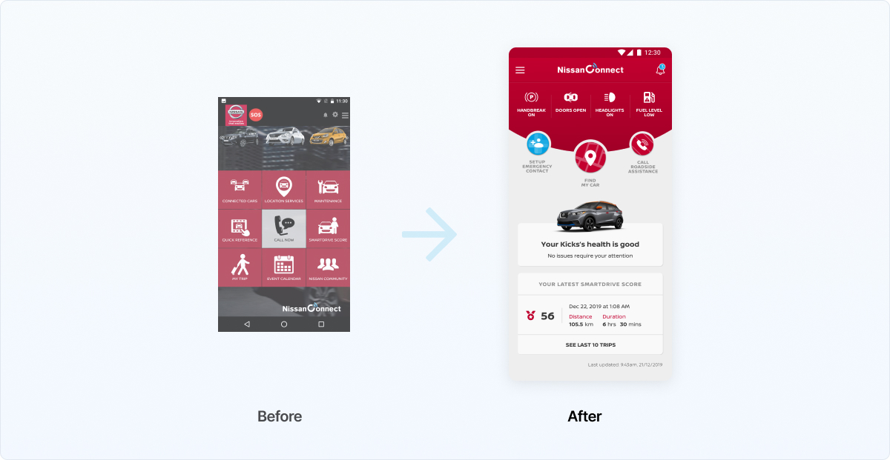
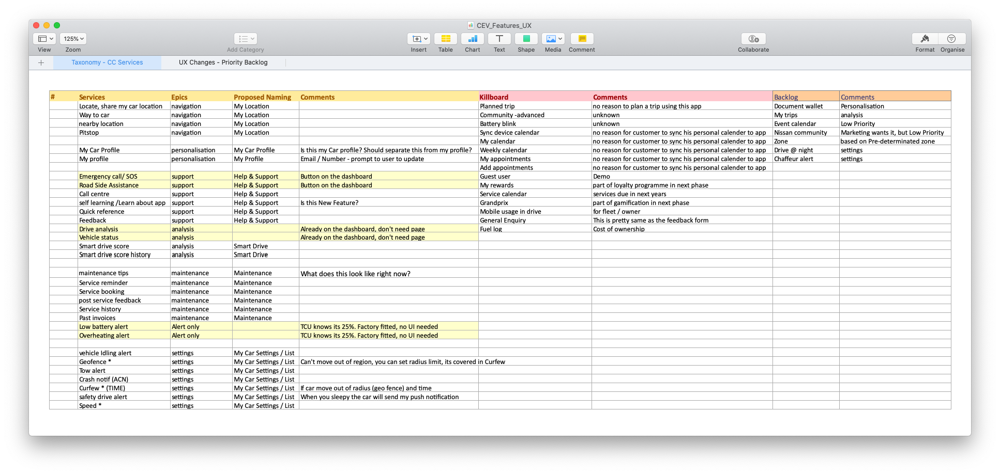
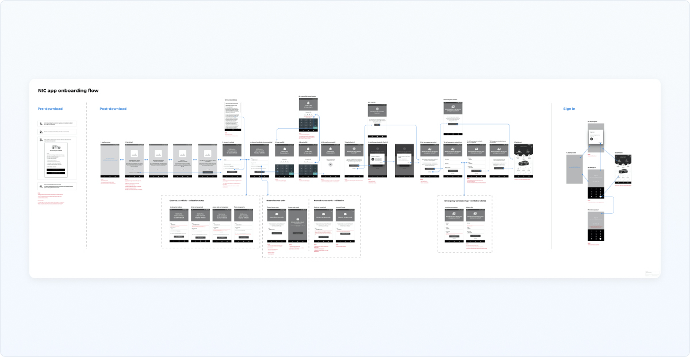
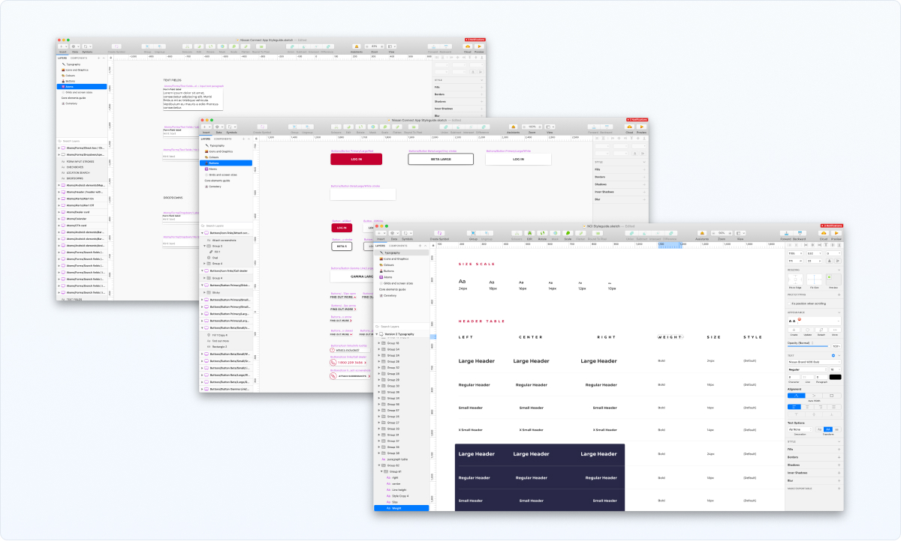
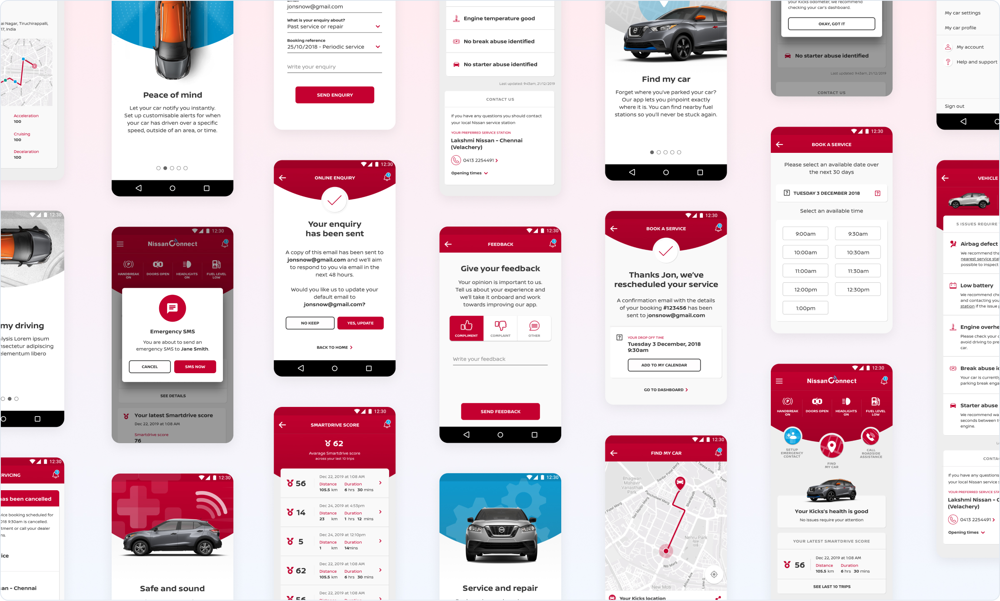

# Connected Experience

Connect EV is a smart remote control and status report application for Nissan Leaf - the Electric Vehicle series equipped with smart sensors all over it. It's main purpose is to keep users connected with their car whenever they want. 
When our team onboarded on the project, there was already an application for such task. On the paper it was doing everything already we've asked for. On the paper tho. The application's reviews were low and when we did a bench mark on the app, it was obvious why the ratings were low. 

 This app was more of a technical proof of concept of what the product can handle more of an end product. Yet, it was released to public use and eventually users weren't happy with it. 

# Painting realistic requirements

First we had to analyse what we had in our hands. Then straight forward to stitching together what we had in our hands and creating a huge list of uncertanities. It was clear why users didn't fancy the app for the first place. Many of the features just showed technical details that daily user didn't needed at all. As we didn't either. So we had to understand what data represented what in the first place so kept a long running dialogue with the developers.

# Synthesizing the case

User interviews granted us great insight into the actual needs of users. The current application was way over the needs. That's why users couldn't use it. It was both too technical hard to use. So we've started to dissect the application features one by one and by the help of the technology department, we've started to stitch together the features. Luckily most of our ideas were feasible to implement on to.

# Refactoring the technology

Meanwhile we kept in touch with a select of users to understand what their actual needs and expecting to see from the app. This was our invisibile 'filter' to remove unnecessary features from the app. Of course with the diaglogues moving forward, we discovered lots of other needs. And majority of those could be translated using the previous 'technical' features. Such as 'Driving Report' and gamify the safe driving score (which was a problem in the region)

