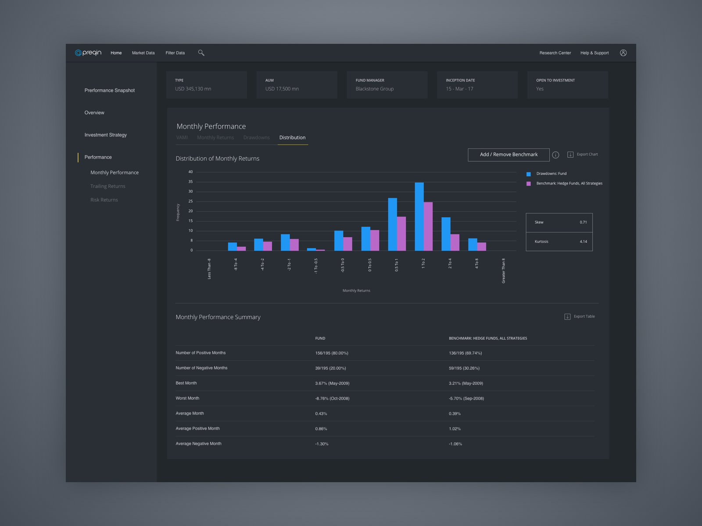

# The clever hero behind the curtains

Preqin is one of the heroes that live behind the curtains and offers its services to fundraisers and investors. They are one of the largest databases of companies who are actively looking for alternative assets. Over a decade old history, Preqin has an exquisite database that could be tailored for their client's needs. That comes with the issue that their digital front-facing application was also done a decade ago. Which didn't quite fit in current technology standards.

# First but a big step towards the new

I was tasked to work closely with the development and client-consultant team to supply their requirements. As I was briefed the client needs from the consultants, on the other hand, I was making sure them if the needs were in perfect fit with the development environment. 

# Charts and charts and more charts

The next part was to fill the framework with the charts. It was tennis between the dev team and analysts as they all relied on live data. As these dashboards could be customized depending if the client requested, I designed the charts where they could be easily switched to another. In a more technical description; I made them modular so they can be reorganized on depending on the client needs. 

