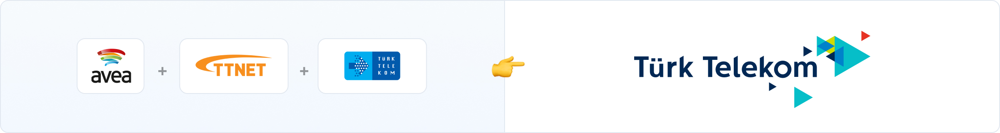
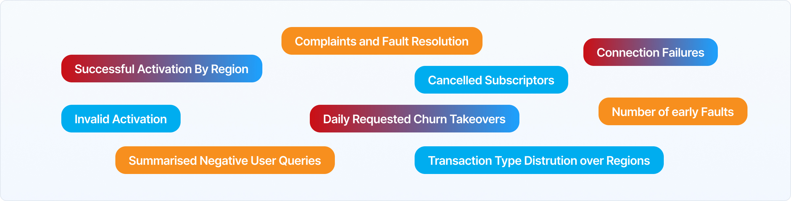
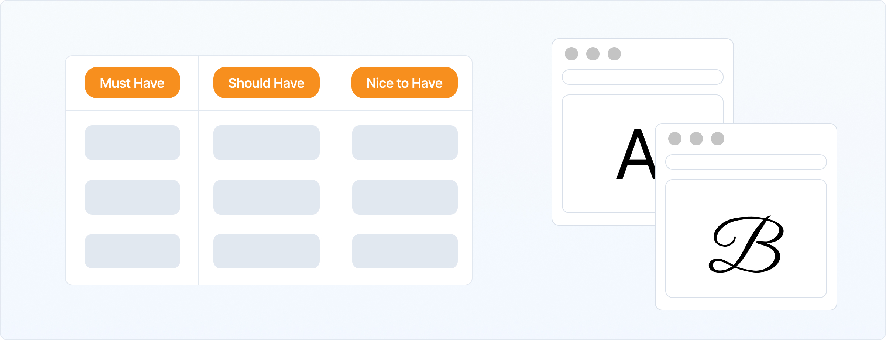
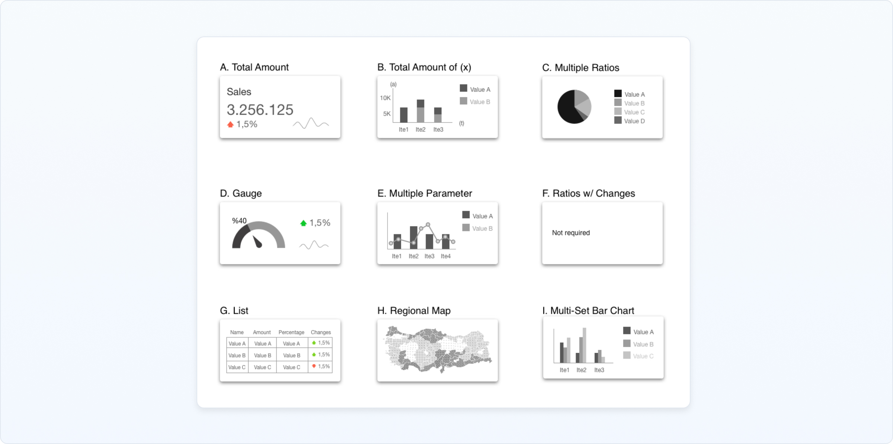
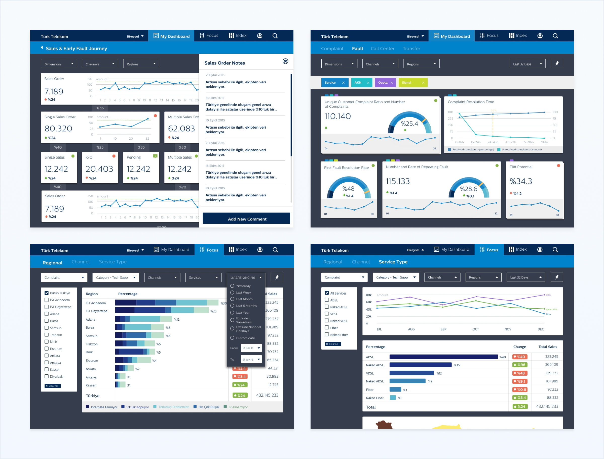
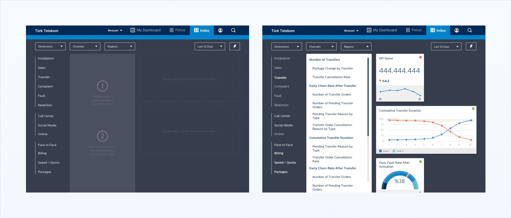
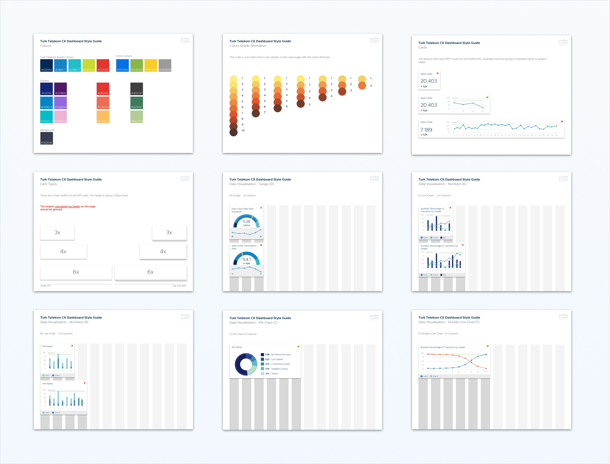

# A bit of history

TurkTelekom is the major landline supplier in Turkey. Not long ago, they have acquired two other companies who were offering GSM and ISP services. As the acquisition time over, they've started to reshape their structure from 'house of brands' to 'branded house' ideology. Which meant all of their services were going to be served under one brand. This also meant that they were going to merge their management departments as well.
 
 
# Bridge to be built

The moment I've stepped into the project I've noticed there was a huge communication issue between the client departments. As I was also alien to their terminology, I've asked if we could meet physically in the same room twice a week. That way I could able direct questions in their presence. So my tasks can get verified by all sides at once. After a couple of meeting sessions, client stakeholders decided to keep the meeting another hour after my session. Because that also created a ground for them to discuss more on other topics as well.

# Spotting the problem

The major issue between teams was communication. Through the merging process, they all needed to decide drastic actions. And they all needed to be in sync so one wouldn't step on to other one's toe. The initiator of these actions was their respective KPI's. Upon investigating these KPI's (with the help of two expert telco consultants) I could able to figure out their KPI's had lots of similarities as all their services were telecommunication based. After getting hold of the KPI lists were used, luckily there were just a few types of data have been aggregated as results. And they could easily be categorised as such.  
  
  
With these outputs I've gathered with the first ideation workshop we've made, we decided to move on with a dashboard where all of these data could be viewed on. All the views are going to be customised into three respective to the departments while they can easily able to switch other stakeholders views.

# Defining Limits

Even though there were just 9 types of data, that just didn't mean I could able to just draw 9 charts. Some of those charts needed detail and some could just be viewed as a basic trend. So the best way to tackle this issue to come up with a modular card system where the pages could be stitched together into the desired page view. This also enabled us to create a new feature so stakeholders can create a customized view just by adding the KPI's that they need.

# Constructing the learnt

All of my learnings were clear as a day. I had to come up with several dashboards where all of their data is aggravated from the same source. So I build a modular and expandable design system where it could be built depending on the stakeholder requirements. As it's impossible to foresee everything, I also built a 'dashboard builder' to allow stakeholders to build their own dashboard layouts.

